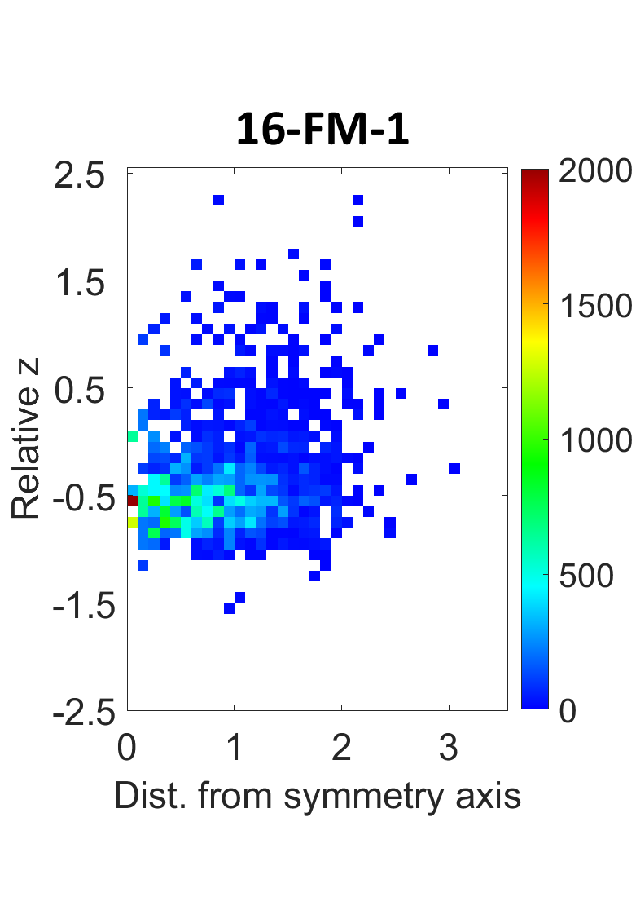
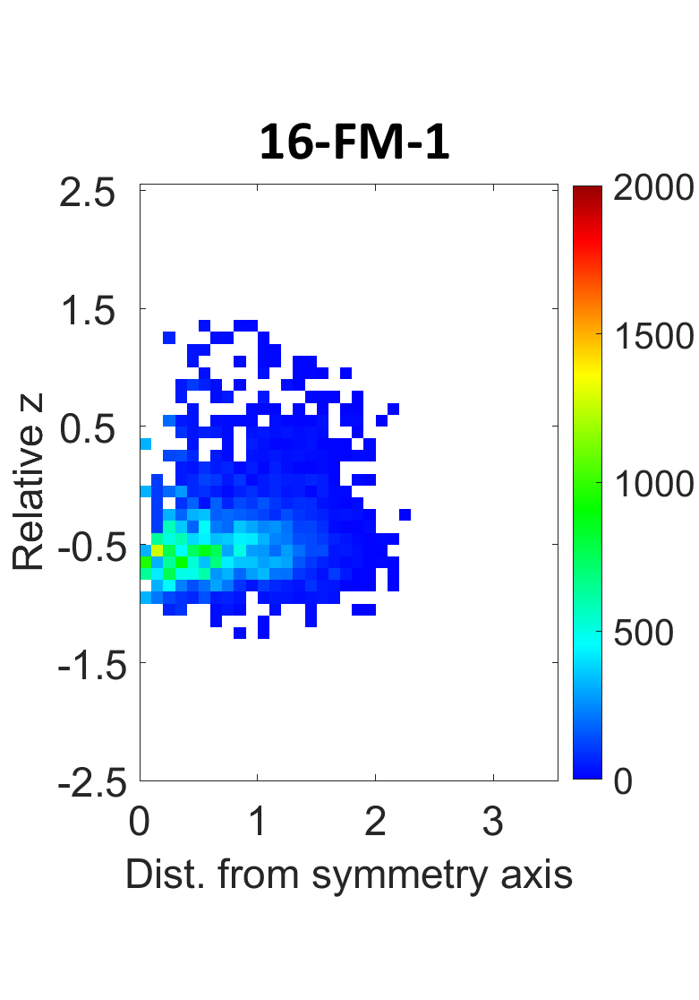

## Dataset: PAINT_DiffTemp

Collected real dataset:

.\Microgel\4_Microgel_plotter_V1_density\PAINT_DiffTemp\Core-shell\\*C\Microgel_plotter_v2_solvatochromism\

where "\*C" means the dataset for the samples at temperature $*^\circ C$


Generated dataset:

.\Microgel\4_Microgel_plotter_V1_density\results_mtemp\results_mtemp_hilo

### Matlab files

Generate the 2d density for generated "go" "gg" samples:

.\Microgel\4_Microgel_plotter_V1_density\visualize_hilo_density


## Dataset: 24

### Features


## Dataset: 16FM

### Features

Microgel point cloud in 2d coordinate with lifetime values as the third dimension.

### Dataset folders

Collected real dataset:

.\Microgel\16-FM\lifetime

Generated dataset: 

.\Microgel\16-FM\results_lifetime

Notes: 

- "sample_go1.ply" denotes the original real sample 1

- "sample_gg1.ply" refers to the corresponding generated sample 1.

- "sample_info1.ply" includes the information for normalizing "sample_go1.ply" and "sample_gg1.ply"

```python

```

### Matlab files

Extract the samples from the entire slide and create 2d density plot for collected real data:

.\Microgel\16-FM\pc16fm_real.m



Create 2d density plot for "go""gg" files

.\Microgel\16-FM\pc16fm_gogg.m


